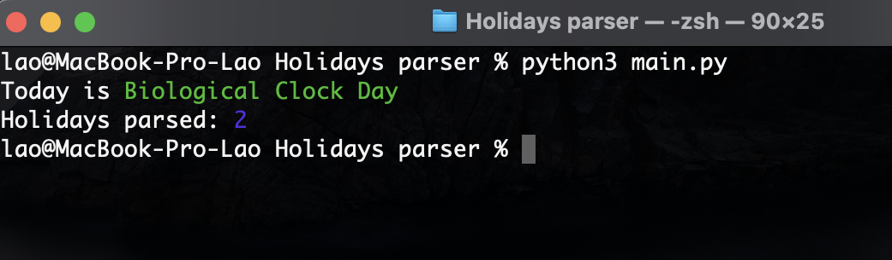
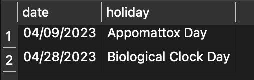

<h1 align="center">
  Holidays parser
</h1>

<p align="center">
  Today's holiday parser with database
</p>


## Screenshots
<p>
  
  
</p>


## Usage
After running the script you will see today's holiday in the output and in the auto-created *holidays.db* file.<br>You can open this database file to see the archive of parsed holidays.


## Installation
### macOS/Linux
*Note:* you need to have Python3 and Git installed in your system before moving to the installation steps.
1. Use this command in the Terminal:
```
git clone https://github.com/codelao/Holidays-Parser.git && cd Holidays-Parser && pip3 install -r requirements.txt && chmod +x parser.py
```
2. Finally, now you can use this command everytime you want to parse today's holiday:
```
./Holidays-Parser.py
```

### Windows 10, 11
*Note:* you need to have Python3 and Git installed in your system before moving to the installation steps.
1. Use this command in the Command Prompt:
```
git clone https://github.com/codelao/Holidays-Parser.git && cd Holidays-Parser && pip3 install -r requirements.txt
```
2. Finally, now you can use this command everytime you want to parse today's holiday:
```
python3 Holidays-Parser.py
```
