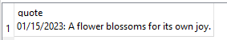

<h1 align="center">
  Holidays parser
</h1>

<h3 align="center">
  Today's holiday parser with database
</h3>


## Screenshots
<p>
  
</p>


## Installation

```
$ git clone https://github.com/codelao/Holidays-Parser.git
$ cd Holidays-Parser
$ pip3 install -r requirements.txt
$ cd code
$ python3 main.py
```


## Usage
After running the script you will find today's holiday in the auto-created database file in the app folder